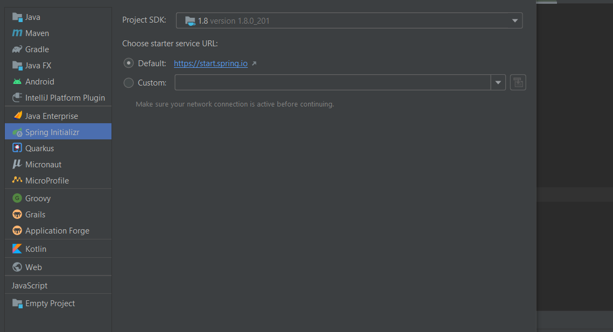
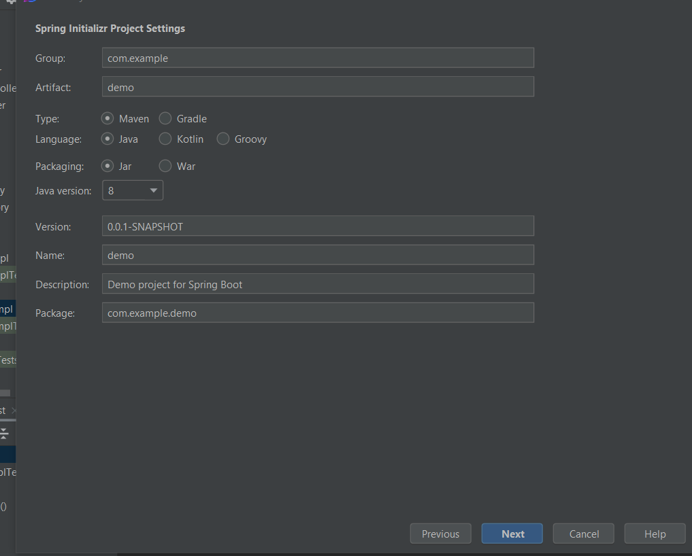
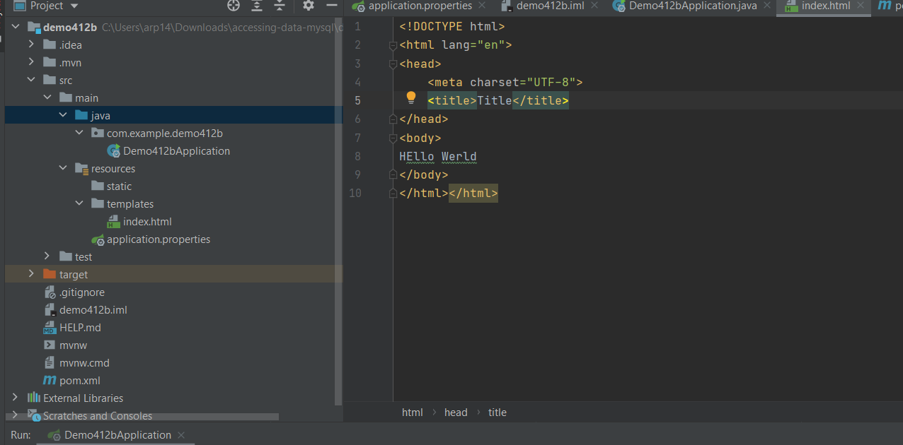

Setup for SpringBoot assignment and Term Project

1. You can use any IDE but all examples are in IntelliJ which I recommend. You can find in PSU labs or download a free version after applying with the steps below.  
    - The Ultimate version is free for students. 
        - Apply for JetBrains Educational Pack with PSU email address on this [site](https://www.jetbrains.com/community/education/#students).
        - Follow JetBrains email confirmation instructions to accept, view, and link the student license to a new/old JetBrains account.
        - Download [IntelliJ IDEA](https://www.jetbrains.com/idea/download/) (Choose Ultimate edition)
        - Sign into Intellij IDEA Ultimate edition with linked account or use the student license activation code to access the license for educational use only.
 
2. After download, follow install instructions [here](https://www.jetbrains.com/help/idea/installation-guide.html)
3. Make sure you have a Java JDK installed. You can download from [here](https://www.oracle.com/java/technologies/javase-downloads.html). You should use JDK 8 or above. Most of my examples are in JDK 8.
4. You need to start a new Project using the Spring Installer



5. You can customize your naming but make sure Maven project type is selected



6. Click the Next button
7. Now you will need to select dependencies

    - For Developer Tools select Spring Boot Dev Tools
    - For Web select Spring Web 
    - For Template Engines select Thymeleaf
    - For SQL select MySQL Driver and Spring Data JPA

8. Click Next, Name your project, Click Finish
9. Install MySQL from [here](https://dev.mysql.com/downloads/installer/)
10. Install MySQL WorkBench from [here](https://dev.mysql.com/downloads/workbench/)
11. When asked during project creation, Install Plugins (box in bottom right corner of screen)
12. Wait for the project to be created, it may take a minute or two
13. Modify the Spring Boot Version:

    - Open the pom.xml (for Maven) or build.gradle (for Gradle) file.
        - Locate the Spring Boot version declaration and change it to your desired 2.x version, such as 2.7.18.

For Maven:

```xml
<parent>
    <groupId>org.springframework.boot</groupId>
    <artifactId>spring-boot-starter-parent</artifactId>
    <version>2.7.18</version>
    <relativePath/> <!-- lookup parent from repository -->
</parent>
```

For Gradle:

```
plugins {
    id 'org.springframework.boot' version '2.7.18'
    id 'io.spring.dependency-management' version '1.0.11.RELEASE'
    // other plugins
}
```

14. In Project menu tree open Project -> src -> resources -> application.properties. Of course you will need to update your MySQL schema name from demo30 to your name and your username and password

```ini
# DATASOURCE (DataSourceAutoConfiguration & DataSourceProperties)
spring.datasource.url=jdbc:mysql://localhost:3306/demo30?useSSL=false&serverTimezone=UTC&useLegacyDatetimeCode=false&allowPublicKeyRetrieval=true
spring.datasource.username=root
spring.datasource.password=root

# Hibernate

# The SQL dialect makes Hibernate generate better SQL for the chosen database
spring.jpa.properties.hibernate.dialect = org.hibernate.dialect.MySQL5InnoDBDialect

# Hibernate ddl auto (create, create-drop, validate, update)
spring.jpa.hibernate.ddl-auto = update

logging.level.org.hibernate.SQL=DEBUG
logging.level.org.hibernate.type=TRACE

spring.jpa.show-sql=true
```

15. Now try to Build the project. It should be successful. 
16. In MySQL workbench, you will need to setup the connection, see this [page](https://dev.mysql.com/doc/workbench/en/wb-mysql-connections-new.html)
17. Then you will need to create a new schema, 4th icon when you click and open the connection you just created. You will name it here and it needs to match where I have demo30 in the application.properties
18. You can add an index.html file within the templates folder as so 



19. You can now open a browser to http://localhost:8080/ and you should see a running webapp on your localhost server
You should now be good to go.
On to the first step in our program.

